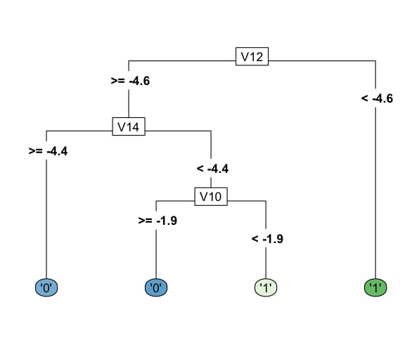
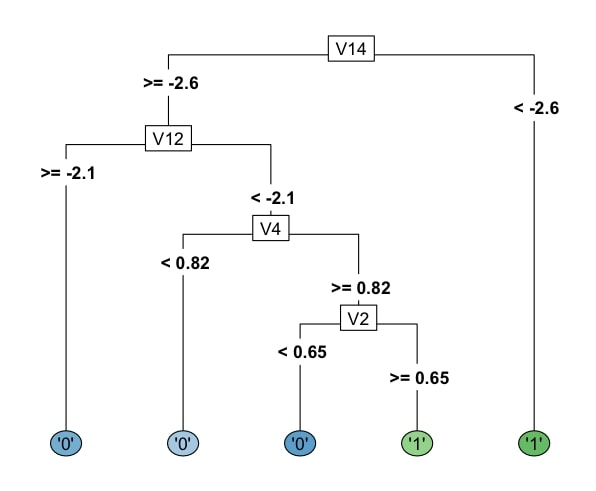

# Credit-Card-Fraud-Detection-Model

The major problem encountered in DATA given for Credit Card transactions:

1)UNBALANCED DATA:

-->
The number of Legitimate transactions exceeds 99% of the total transactions. Due to this, the Classifier tends to
favour the majority class. This leads to errors in the classification of fraud cases.To tackle this issue, we try
to balance the dataset using several techniques, such as ROS( Random Over Sampling ) and ( Random Under Sampling ).

-->
ROS and RUS have disadvantages, and we use a new technique called SMOTE( Synthetic Minority Oversampling TEchnique).
This technique creates synthetic samples for our model.

## Results
Reference -> columns    
Prediction -> rows

### Confusion Matrix and Statistics for ORG MODEL

| Reference/Prediction | '0'    | '1'    |
|-----------------------|--------|--------|
| '0'                   | 28428  | 5      |
| '1'                   | 8      | 39     |

               Accuracy: 0.9995

### Confusion Matrix and Statistics for SMOTE MODEL

| Reference/Prediction | '0'    | '1'    |
|-----------------------|--------|--------|
| '0'                   | 27958  | 1      |
| '1'                   | 478    | 43     |

                                          
               Accuracy: 0.9832  

Our main aim is to create a model which can correctly identify a maximum number of true positives.

The Smote model is better (at a little less efficiency) as it correctly identifies more true positive fraud classes(43) than the Org model(39), which is trained on all training data.       
 
